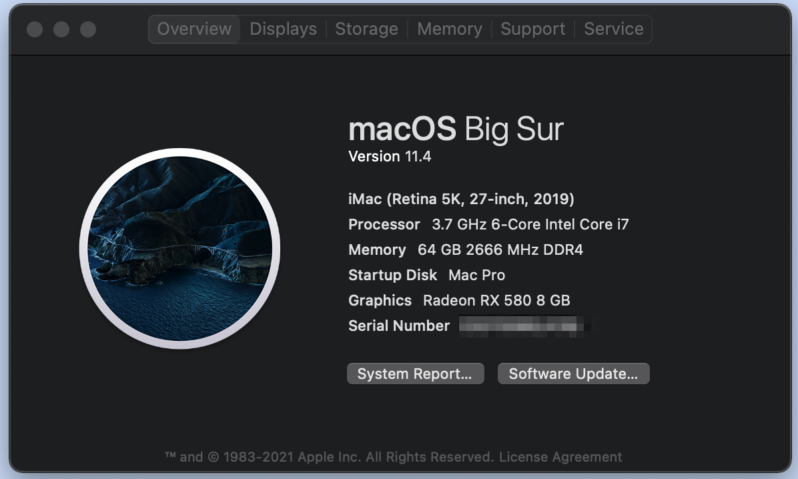

# GIGABYTE Z390 AORUS PRO Wi-Fi  - OpenCore - macOS Big Sur

## Benchmarks (Geekbench)

CPU:

- Single-core: [1051](https://browser.geekbench.com/v5/cpu/8530772)
- Multi-core: [5355](https://browser.geekbench.com/v5/cpu/8530772)

---
## **Hardware**

| Component     | Product                           |
| ---------     | --------------------------------- |
| CPU           | Intel Core i7 8700K               |
| Case           | Corsair iCUE 4000X RGB           |
| RAM           | Corsair Vengeance LPX 64GB (4x16GB)|
| Motherboard   | GIGABYTE Z390 AORUS PRO Wi-Fi     |
| GPU           | PULSE RX 580 8G G5
| SSD           | Samsung 970 EVO Plus SSD 1TB - M.2 NVMe      |
| SSD           | Samsung 970 EVO Plus SSD 1TB - M.2 NVMe      |
| BT/Wi-Fi      | Fenvi T919 Bluetooth/Wi-Fi Card   |
| Power Supply           | Samsung 970 EVO Plus SSD 1TB - M.2 NVMe      |
| Monitor 1           | [Lg 43''](https://www.lg.com/us/monitors/lg-43UD79-B-4k-uhd-led-monitor)      |
| Monitor 2           | [DELL P2720d](https://www.dell.com/en-us/work/shop/dell-27-monitor-p2720d/apd/210-aulk/monitors-monitor-accessories)      |

---
# Checklist
* [x] shutdown
* [x] restart
* [x] sleep
* [x] audio
* [x] ethernet
* [x] wifi
* [x] bluetooth
* [x] App Store
* [x] Airdrop
* [x] Right Frequency
* [x] iMessage
* [x] FaceTime
* [x] iCloud
* [X] side car 
* [x] Apple Watch Unlock

---
## **Installation**

#### **Official Docs**

Be sure to read the [official OpenCore documentation] if you have any questions before posting an issue.

#### **Customize the `config.plist`**

The following fields have been replaced by `<<CHANGE_IT>>:

- `config.plist` > `PlatformInfo`
  - `SystemSerialNumber`
  - `SystemUUID`
  - `MLB`
    Follow the [OpenCore instructions](https://dortania.github.io/OpenCore-Post-Install/universal/iservices.html#generate-a-new-serial) to generate your own unique identifiers. The AppleCare step is optional.

#### **BIOS configuration**

- Intel Platform Trust Technology (PTT) => Disabled
- Legacy USB Support => Disabled 
- XHCI Hand-off => Enabled
- SATA Mode Selection => AHCI
- CFG Lock => Disabled
- Fast Boot => Disabled

